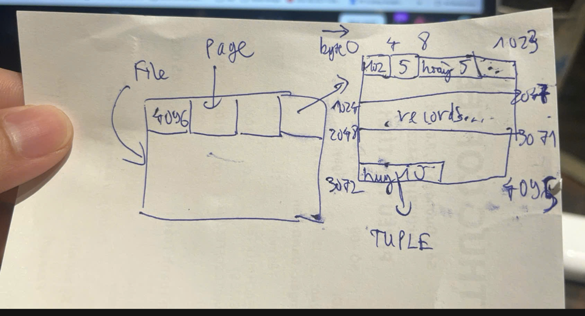
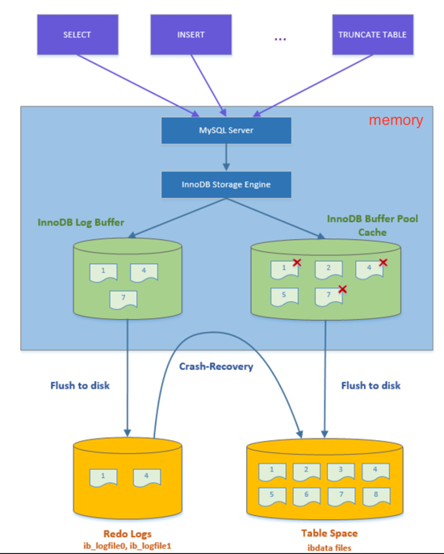
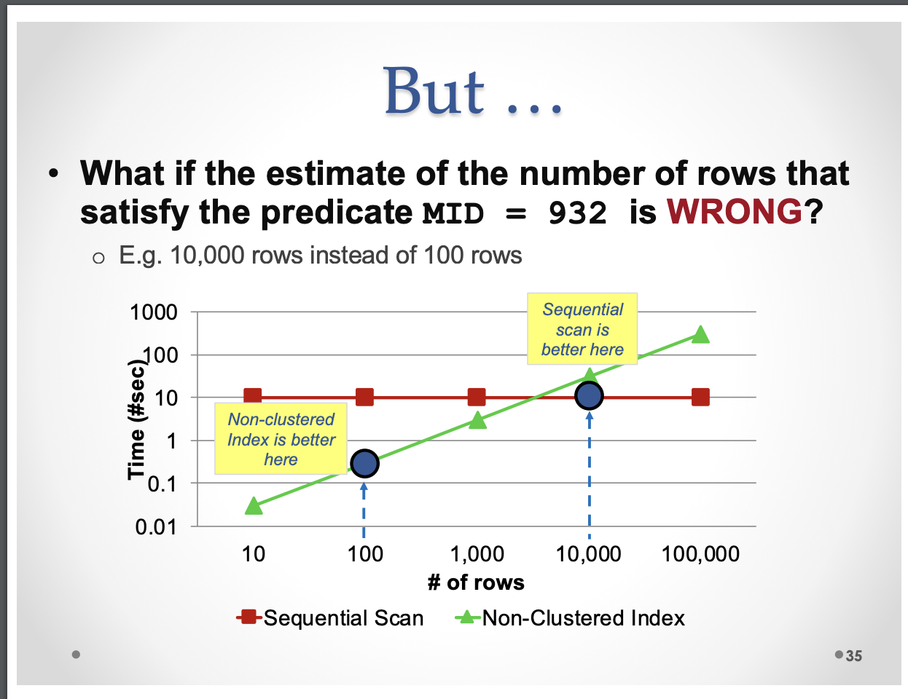

# Tìm hiểu database management system cơ bản (part 1)

## Giới thiệu tổng quan

- Tóm tắt lại đã học được gì từ khoá học MIT 6.830.
- Mình bắt đầu khoá học MIT https://dsg.csail.mit.edu/6.5830/ và hoàn thành các lab của khoá học (3
  lab), là hoàn thiện 1 database management system cơ bản.
- Git repo gốc: https://github.com/MIT-DB-Class/go-db-hw-2023
- Repo của mình: https://github.com/trandanhhoang/database-go

## Giới thiệu bài hôm nay
- Thời gian đọc: 30-60 phút đọc.
- Chúng ta sẽ học về cách database tổ chức dữ liệu ở trên disk, cách chúng ta load lên mem.
- Cách DB optimize query, và các cách thực hiện phép join.

## Chúng ta sẽ cố gắng học theo hướng bottom-up.

### Nhưng ban ban đầu hãy có 1 cái nhìn tổng quan, khi trả lời các câu hỏi, chúng ta có thể tham chiếu lại hình này.

- Các thành phần chính của Database
    - 

- Trong đó,
    - Client Communication Manager: thiết lập kết nỗi giữa client và database server.
    - Process Manager: DB cần "admission control", câu query nào đủ resource, thì mới được thực
      hiện.
    - Relational Query Processor: parse câu query, optimize query.
    - Transactional Storage Manager:
        - Access Methods: Nơi tổ chức, truy cập dữ liệu trên disk (ví dụ: heap_file, Btree)
        - Buffer Manager: Quyết định dữ liệu khi nào được lưu trên memory, disk.
        - Lock Manager, Log Manager: Đảm bảo ACID
    - Share component & Utilities:

- Chúng ta sẽ tập trung vào Transaction Storage Manager.

## Chúng ta sẽ bắt đầu các câu hỏi để xây dựng kiến thức.

### Tại sao chúng ta không lưu dữ liệu dưới file txt, hay excel, mà phải dùng database ?

- DB giúp chúng ta truy vấn dữ liệu với SQL, file thì không.

### Dữ liệu bên dưới thực sự được lưu trữ như thế nào ?

- Cho schema sau:

```sql
CREATE TABLE student
(
    id   INT,
    name VARCHAR(32),
);
```

- Các `TUPLE`( hàng dữ liệu, record, row) là nơi lưu giá trị, tương ứng với kiểu dữ liệu (string,
  int, ...) được định nghĩa trong schema.
    - giả sử kiểu int 8B, string 32B, thì hàng trên sẽ có size = 8 + 32 = 40 Byte (Tất nhiên là DB
      sẽ hỗ trợ dynamic size cho các kiểu dữ liệu, nhưng mình sẽ bỏ qua để đơn giản cho các tính
      toán sau này).
- `PAGE` thường có size = 4096B. Tuỳ thuộc vào cấu trúc dữ liệu của AccessMethod (heapfile hoặc
  Btree), mà cách chúng ta lưu trữ dữ liệu cũng khác nhau. Ví dụ với heap-file
    - Mỗi PAGE sẽ để dành 8 Byte để lưu trữ `metadata`, ví dụ: số tuples hiện tại, và số tuples tối
      đa có thể lưu trữ.
    - Các tuple được lưu liên tiếp với nhau.
    - Với TUPLE có size là 40 Byte, thì 1 PAGE sẽ lưu được (4096 - 8) / 40 = 102 tuple. với 8 Byte
      cho metadata.
- `FILE` thì bao gồm nhiều PAGE.
- hình ảnh vẽ file nếu sử dụng `HEAPFILE`
    - 

### Access Method là gì ?

- Là cách mà chúng ta read, write dữ liệu từ disk lên memory.
    - HeapFile: Lưu trữ dữ liệu liên tiếp nhau, đơn giản.
    - Btree: Hỗ trợ range query.
        - Bạn có thể đặt câu hỏi tại sao ko dùng Binary search tree, mà phải dùng Btree, thì mình có
          thể giải thích ngắn gọn, trọng tâm là:
            - Cây BST thì cao hơn cây BTree, dẫn tới Btree giúp chúng ta giảm số lần truy cập disk,
              vì mỗi lần truy cập disk là rất tốn kém.
    - HashIndex: Hỗ trợ equal query, không hỗ trợ range query.
- TODO: hình ảnh vẽ file nếu sử dụng BTREE, B+TREE

### Vậy khi 1 File lên tới hàng terabyte, chúng ta có load toàn bộ file từ disk vào memory không ?

- Rõ ràng là không thể, vậy nên chúng ta sẽ dùng `BUFFER_POOL`. BUFFER_POOL không chỉ quản lý PAGE
  cho 1 FILE duy nhất.
- 
- reference of image: https://white-night.club/index.php/2023/10/24/pg17/

- Bạn có thể thấy bufferpool để lưu các page đang được sử dụng, nếu PAGE được chỉnh sửa, ta gọi đó
  là `DIRTY PAGE`.
    - Khi bufferpool đầy, mà lại muốn load các PAGE mới lên, PAGE không phải là DirtyPage sẽ được ưu
      tiên xoá khỏi bufferpool.

### Vậy nếu client yêu cầu 1 lệnh order by trên toàn bộ record, sau đó lấy ra 100 record đầu tiên thì chúng ta xử lý như thế nào ?

```sql
    SELECT *
    FROM student
    ORDER BY id LIMIT 100;
```

- Chúng ta không thể đưa 1 tỉ record lên memory, rồi chạy records.sort() 1 cách đơn giản được.
- Chúng ta sẽ sử dụng `MERGE-SORT`.
    - bạn có thể xem rõ hơn ở đây: https://www.youtube.com/watch?v=F9XmmS8rL4c

### Nghiên cứu sâu hơn về SQL, SQL hỗ trợ các Operator nào ?

- Operators
    - Insert, Delete
    - Filter, Join
    - Aggregate (min, max, sum, avg, count)
    - Project, Order by, Limit
- “Iterator” model được sử dụng trên operators để hoạt động cùng với SQL.
- Ý tưởng ở đây là, chúng ta sẽ soạn 1 query bằng cách đưa Operator con vào Operator cha, ví dụ:

```sql
SELECT COUNT(name)
FROM t1,
     t2
WHERE t.name = t2.name
  AND t.age > 30.
```

- (1) fileT1 = NewFile(t)
- (2) fileT2 = NewFile(t2)
- (3) join = NewIntJoin(fileT1, fileT2, t.name = t2.name)
- (4) filter = NewFilter(join, t.age > 30)
- (5) count = NewAggregate(filter, COUNT)
- (6) project = NewProject(count, t.name)

- Bạn có thể tưởng tượng, 2 file đầu tiên, ví dụ file 1 có 100 records, file 2 có 50 records, sau
  khi đi qua operator join
- tại bước (3), sẽ có 5000 records được join với điều kiện t.name = t2.name, ví dụ còn lại 2500
  records.
- tại bước (4), sau khi qua filter1, có thể còn 1000 records
- tại bước (5), Bước Aggregate sẽ duyệt qua toàn bộ record còn lại (500 record ở bước 5)
    - Nếu là count thì tạo 1 biến đếm, mỗi lần đi qua 1 record th cộng 1 vào biến đếm
    - Nếu là sum thì tạo 1 biến sum, mỗi lần đi qua 1 record thì cộng thêm giá trị của record đó vào
      biến sum
    - Nếu là max thì luôn giữ giá trị lớn nhất, ...
- Tại bước 6, Operator Aggregate sẽ cho chúng ta thêm 1 column vào record, ví dụ: count(name) = 500,
  và chúng ta sẽ lấy được giá trị đó ra.

- Các bước trên nảy sinh ra 2 bài toán mới
    - Bạn có thể thấy các bước ở trên đang chưa được `OPTIMIZE` ?
    - Phép Join ở trên được thực hiện như thế nào ?

### OPTIMIZE QUERY

- Bạn có thể đọc từ slide này (chi tiết hơn tóm tắt của mình): - https://dsg.csail.mit.edu/6.5830/2023/lectures/lec10.pdf
- Từ các LOGICAL PLAN, có thể viết thành các PHYSICAL PLAN khác nhau.
    - LOGICAL PLAN là "WHAT THEY DO": bạn có thể JOIN, GROUP, FILTER, ...
    - PHYSICAL PLAN là "HOW THEY DO": JOIN thì có NESTED LOOP, INDEX NESTED JOIN, HASH JOIN, MERGE
      JOIN, .... Bạn sẽ dùng gì ?
- Ví dụ đếm số plan:
  - bạn có 9 logical plan, và 10 physical plan, chúng ta sẽ có 90 plan khác nhau.
  
- Để có cái nhìn rõ hơn về LOGICAL PLAN, PHYSICAL PLAN, mình ví dụ với câu query như sau,
```sql
SELECT Average(Rating)
FROM reviews 
WHERE mid = 932;
```

- LOGICAL PLAN sẽ là:
    - (1) 10 triệu record của bảng reviews.
    - (2) SELECT mid = 932
    - (3) AVG rating
- PHYSICAL PLAN sẽ là:
    - cách 1: SCAN + FILTER qua tất cả các record
        - (1) SCAN qua 10 triệu records của table reviews
        - (2) FILTER trên 10 triệu records để tìm mid = 932. O(N)
        - (3) AVG rating
    - cách 2: Dùng `INDEX` được đánh trên cột mid.
        - (1) dùng index trên cột mid = 932 để tìm ra các records thoả mãn trong O(1).
        - (2) AVG rating
- Chúng ta sẽ estimate cost của các PHYSICAL PLAN, và chọn ra PHYSICAL PLAN có cost thấp nhất.

### ESTIMATE COST

- Chúng ta có 2 chi phí cần quan tâm
    - I/O times: chi phí đọc PAGE từ disk.
    - CPU time: chi phí xử lý operators (filter, join, ...), khi duyệt qua các records trên MEMORY.
- Ví dụ câu query sau:

```sql
SELECT Average(Rating)
FROM reviews
WHERE mid = 932;
```

- Với tiền điều kiện:
    - (1) Table reviews có 100k page, mỗi page có 100 records -> 10 triệu records. Size file = 800
      MB.
    - (2) CPU time = 0.1 μs (10^-6s)/row cho `FILTER predicate`
    - (3) CPU time = 0.1 μs (10^-6s)/row cho `AVG predicate`
    - (4) Random disk I/O = 0.003 second per disk I/O.
    - (5) Table được lưu trong disk bằng cách sorted theo cột `date`.
    - (6) Giả sử có 100 records thoả mãn MID = 932.
    - (7) I/O có thể Scan table reviews với 100MB/second

- Cách 1: scan + filter
    - SCAN: Từ điều kiện 1 + 7, ta tính được: 800/100 = 8 seconds.
    - filter được apply cho 10M rows. dùng điều kiện (2) để tính = 1 seconds.
    - AVG dược apply trên 100 rows (điều kiện 6). tiếp tục dùng điều kiện (3) để tính cost, bé quá
      bỏ qua.
    - Chúng ta sẽ có tổng thời gian là 8 (SCAN) + 1 (FILTER) = 9 seconds.

- Cách 2: dùng `INDEX` ở cột MID
    - Chúng ta biết 100 rows thoả điều kiện, `MID index`
        - Với điều kiện (5), chúng ta giả sử các records thoả mãn nằm rải rác ở 100 page khác nhau (
          Khi dữ liệu không được sắp xếp theo MID, các bản ghi có mid = 932 có thể nằm rải rác ở
          nhiều nơi khác nhau trên đĩa.)
        - Kết hợp với điệu kiện 4, chúng ta đọc 100 page, 100*0.003 = 0.3s
        - Vậy tổng thời gian chúng ta cần chỉ có 0.3s (cho seek disk trên 100 page).

- Nếu `INDEX` trên cột MID không phải chỉ có 100 row thoả mãn, mà là 10.000 rows thì sao ?
    - index có thể cần tới 30 giây.
- 

- Phép Join cũng là 1 phần của quá trình Optimize Query, chúng ta sẽ tìm hiểu ở mục tiếp theo.

### Phép Join được thực hiện như thế nào, độ phức tạp của mỗi loại ?

- `NESTED LOOP JOIN`
    - Cơ bản là vòng lặp loop, với mỗi tuple của t1, chúng ta sẽ duyệt qua toàn bộ tuple t2, và lấy
      tất cả các tuple thoả điều của phép join.
        - ví dụ:
            - t1 có `tuple1 = hoang, 5`.
            - t2 có `tuple1 = hoang, 4`; `tuple2 = hoang, 5`; tuple3 = huy, 6; tuple4 = ngoc, 7
            - thì chúng ta sẽ có 2 tuple thoả điều kiện của phép join
        - Độ phức tạp giải thuật, t1 có N tuple, t2 có M tuple
            - thì độ phức tạp là O(N*M)

- `INDEX NESTED LOOP JOIN`
    - Độ phức tạp giải thuật, t1 có N tuple, t2 có M tuple (được đánh index)
        - thì độ phức tạp là O(N*logM)

- `HASH JOIN`
    - Độ phức tạp giải thuật, t1 có N tuple, t2 có M tuple. Cả 2 đều không được đánh index.
        - Chúng ta hash trên điều kiện đầu vào, của bảng có size nhỏ hơn. Sau đó duyệt trên bảng lớn
          hơn, và kiểm tra xem có trong hash table không.
        - thì độ phức tạp là O(N + M)

- `MERGE JOIN`
    - Được sử dụng khi cả 2 bảng quá lớn
    - Độ phức tạp là O(N + M) hoặc O(N*logN + M*logM) tuỳ theo cột đã được sắp xếp hay chưa.

- Ngoài ra còn rất nhiều cách khác, nhưng mình không muốn biến đây thành 1 bài học DSA.
- Query Optimization sẽ chọn ra phép join tốt nhất tuỳ thuộc vào số lượng record, index, selectivity
  factor. Bạn có thể tự đào sâu nếu muốn.

### Bài hôm nay cũng đã dài, hẹn gặp lại các bạn ở bài tiếp theo.