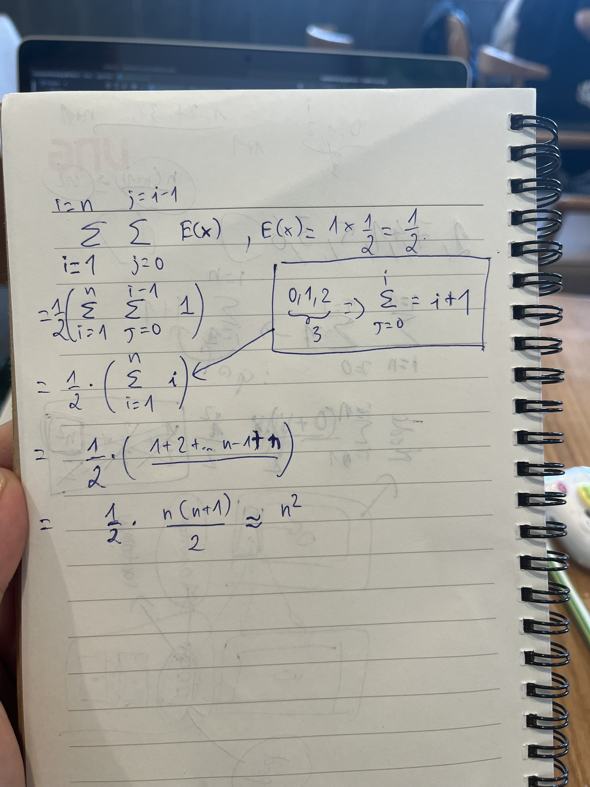

# Bubble sort
- We will learn some keyword, notation, statement in english.
- Let say we have the following array `[2,7,4,1,5,3,6]`, and we want it sorted in increasing order.

## Code in java
```java
public static void main(String[] args) {
        List<Integer> integers = Arrays.asList(2,7,4,1,5,3,6);

        int size = integers.size();
        
        System.out.println(integers);
        for (int i = size-1; i > 0; i--) {
            for (int j = 0; j < i; j++) {
                if(integers.get(j) > integers.get(j+1)){
                    swap(integers,j,j+1);
                }
            }
            System.out.println(integers);
        }
    }
    private static void swap(List<Integer> integers, int left, int right){
        int temp = integers.get(left);
        integers.set(left, integers.get(right));
        integers.set(right,temp);
    }
```

## Analysis the algorithm
- The outer loop is start at the end of the array, index I.
- The inner loop is start at the front of the array, index J.
- The purpose is moving the largest element into the last index I after each inner loop. In the inner loop,  we will compare the element at J with the right element of it, J plus 1. If the left is larger, we swap it. J will finish when J equal I.

## Complexity
- Now, we will analyze the time complexity of all case (worst case, average case, best case).
  - we have two operation here, comparison and swap. 
  - if we choose the abstract operation is comparison, the time complexity is same at all case.
  - so, we will choose the swap operation is the abstract operation.
- For the best case
  - is the sorted list [1,2,3,4,5], we do no swap
- For the worst case
  - is the reverse sorted list [5,4,3,2,1], we do swap each time we do the comparison.
- For the average case
  - we do some, we don't some.

- The space complexity is Big O of one 'O(1)', because we do not require any additional memory space.

## Analysis the time complexity of average case
- 
- Sigma i from 1 to n, Sigma j from 0 to i-1 of Expected value
  - with: Expected value = sum of possibilities times chance per possibilities
  - possibilities = `[0,1]` is we do the swap or not.
  - chance per possibilities = 1/2 (example, 1/6 with dice) (we call 1/2 = one over two)
    - Now we have `E[x]` = 1 * (1/2) = 1/2 = (one times one over two)
- After do some calculation, we drop the weak factor, we will have the time complexity is Big O of n square = O(n^2) = Big O of n hat 2= Big O of n to the power of 2, where n is the size of array list.