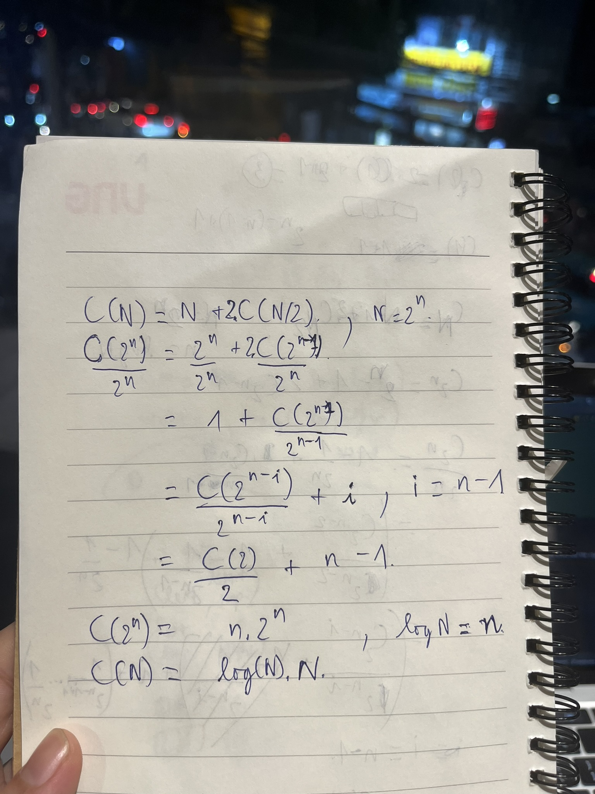
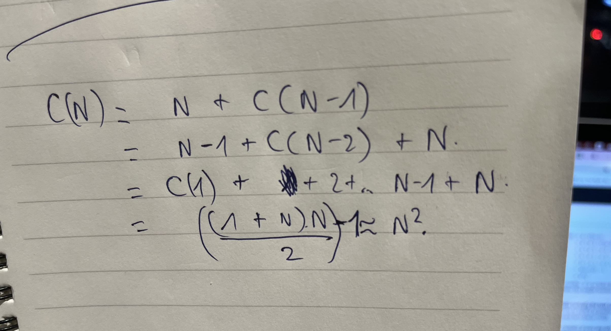

# Quick sort
- We will learn some keyword, notation, statement in english.
- Let say we have the following array `[2,7,4,1,5,3,6]`, and we want it sorted in increasing order.
  - we will use the pivot (ˈpivət) in this algorithm, and code recursively. 

## Code in java
```java
public static void main(String[] args) {
//        List<Integer> integers = Arrays.asList(2, 7, 4, 1, 5, 3, 6);
//        List<Integer> integers = Arrays.asList(5,6);
//        List<Integer> integers = Arrays.asList(6,5);
  List<Integer> integers = Arrays.asList(2, 7, 4, 1);

  int size = integers.size();

  quickSort(integers, 0, size - 1);

  System.out.println(integers);
}

private static void quickSort(List<Integer> integers, int left, int right) {
  if (left >= right) return;

  int pivot = left + (right - left) / 2;
  swap(integers, pivot, right);
  int localRight = right - 1;
  int localLeft = left;

  while (localLeft <= localRight) {
    while (integers.get(localLeft) < integers.get(right)) {
      localLeft++;
    }
    while (localRight >= 0  && integers.get(localRight) > integers.get(right)) {
      localRight--;
    }
    if (localLeft > localRight) {
      break;
    }
    swap(integers, localLeft, localRight);
  }
  swap(integers, localLeft, right);

  quickSort(integers, left, localLeft - 1);
  quickSort(integers, localLeft + 1, right);
}


private static void swap(List<Integer> integers, int left, int right) {
  int temp = integers.get(left);
  integers.set(left, integers.get(right));
  integers.set(right, temp);
}
```

## Complexity and Analysis the time complexity of average case
- We call C(N) is the number of comparison perform in quicksort.
  - N-1 is a number of comparison to divide array into 2 array that the left array always less than the pivot and the right array larger than pivot.
- We will have formula below for the best case
  - C(N) = N - 1 + 2*C(N/2) , C(0) = C(1) = 0
  - 
- Worst case
  - C(N) = N - 1 + C(N-1) + C(1), C(0) = C(1) = 0
  - 
- Average case
  - C(N) = N - 1 + C(k) + C(N-k), C(0) = C(1) = 0

- reference: 
  - https://homepages.math.uic.edu/~leon/cs-mcs401-r07/handouts/quicksort-continued.pdf
  - https://hqt.github.io/2020-10-10-quicksort-time-complexity-proof/
